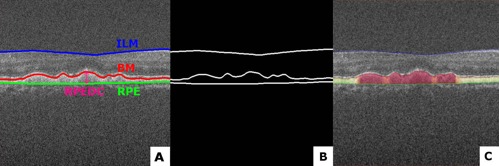
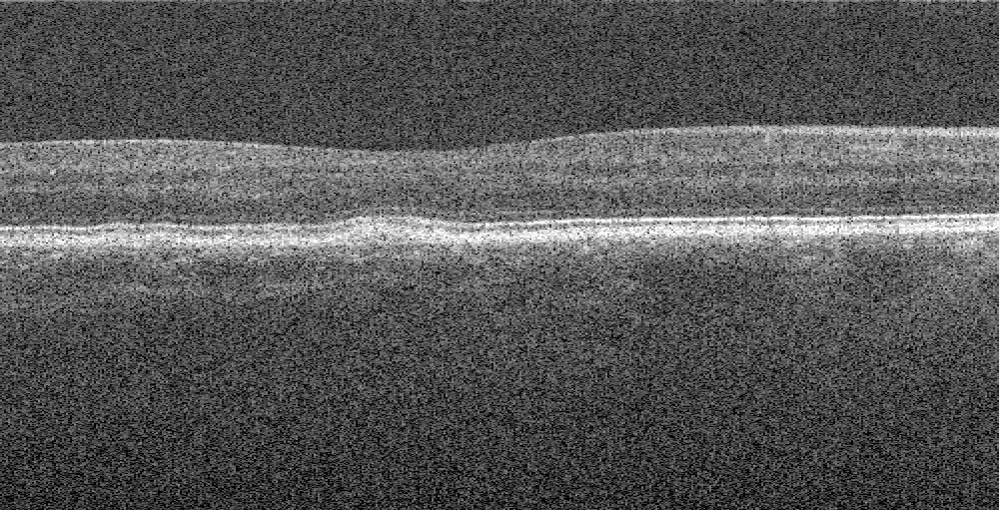

# RPE Drusen Complex Segmentation by UNET network 

## Summary

This repo is put together for automatically segmenting the RPE-complex with a convolutional neural network based on the [Unet architecture](http://lmb.informatik.uni-freiburg.de/people/ronneber/u-net/). Together with postprocessing-operations, giving the following results in different datasets as shown in the figure 1. A network was trained with Keras backend on [the Duke University SD-OCT datatset](http://people.duke.edu/~sf59/RPEDC_Ophth_2013_dataset.htm).  Firstly the retinal layers get segmented (ILM, BM and RPE). After postprosessing, the difference between the BM and the RPE is a calculated. Resulting in a Dice-score of 0.979. 

Figure 1. Original image with markings of the layers for information (A), The annotated ground thruth mask (B), Prediction of the model with a visualization gradient (C). All from the Duke University Dataset

---
## Overview

### Data set & Data preperation
A total of 15744 SD-OCT B-scans (Bioptigen SD-OCT, NC, USA) from 269 AMD patients and 115 normal subjects, selected from the Duke dataset, were used in this study for training and cross-validation. The dataset was split on subject level in 80% training, 20% testing. Validation set was later split from the training set in the ImageDataGenerator function of Keras. 

For training the model, a partition of [the Duke University SD-OCT datatset](http://people.duke.edu/~sf59/RPEDC_Ophth_2013_dataset.htm) was used for training. These images were transfered from their .mat format to .tif images for better use in generators. Only slice 30 to 70 was used, they only had the fully annotated masks. Masks were made by convertining the pixel wide annotated mask to a 3 pixel wide annotated mask which can been seen i. All this preprocessing is done by the code imagemaskfrommat.py. 

|   Figure 2. Example of an converted OCT image by the .mat file  	|    Figure 3. Example of an 3 pixel wide converted ground thruth mask by the .mat annotation 	|
|---|---|

### Data Augmentation & Normalization
The Keras ImageDataGenerator has been used to generate batches of augemented images during training by using multi-processing. The geometric & intensity based augementations used are: 

| Augmentation | Type | Value | 
|---|---|---|
| horizontal_flip | Geometric Augmentation | True | 
| zoom_range | Geometric Augmentation | 0.9 , 1.2 |
| width_shift_range  | Geometric Augmentation| 0.95 , 1.05 | 
| height_shift_range | Geometric Augmentation| 0.95 , 1.05 |
| shear_range | Geometric Augmentation | 0.95 , 1.05 | 
| brightness_range | Intensity Augmentation | 0.4, 1.2 | 
| featurewise_center | Normalization Operation | True | 
| featurewise_std_normalization | Normalization Operation | True | 

### Model & Parameters 
The U-NET model has been used for segmenting the three retinal layer with an input resolution of 512 x 512 x 1. Training was done for 100 epochs on the above writen dataset with augmentations with the following parameters

| Parameter | Value | 
|---|---|
| Batch size | 16 | 
| Epochs | 100 | 
| Loss function | Generalized Dice Loss | 
| Metric | Dice Coef | 
| Optimizer | Adam | 
| Dropout | 0.25 | 
| Filters | 16 | 
| Learning rate | 1e-4, 1e-5, 1e-6 | 

### Evaluation
After this evaluating is done on the testing portion, a Dice-score of 0.979 was achieved.

### Predicting
After the model is done training, you can let it predict the retinal images from an OCT scan. Find one on Google and test it yourself! Firstly, a prediction is done which results in a imperfect binary mask. Second, all small connected components get removed. Third, a minimum cost path approach is applied to fill in gap in the lines. To visualize the area, we based it on the average between the lines. 

### Feature Extracting
Different features can be extracted from these images such as shape-based, intensity-based and texture-based features. 
